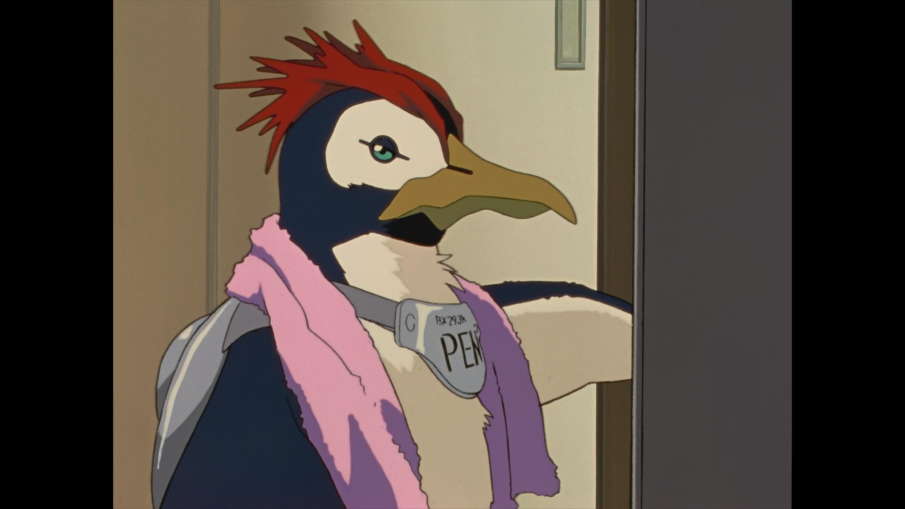

# CHATapp

<div align="center"></div>

Write a simple Streamlit app that can chat with the model on Ollama.

```shell
python -m venv venv
source venv/bin/activate
python -m pip install --upgrade pip
pip install -r requirements.txt
streamlit run run.py
```